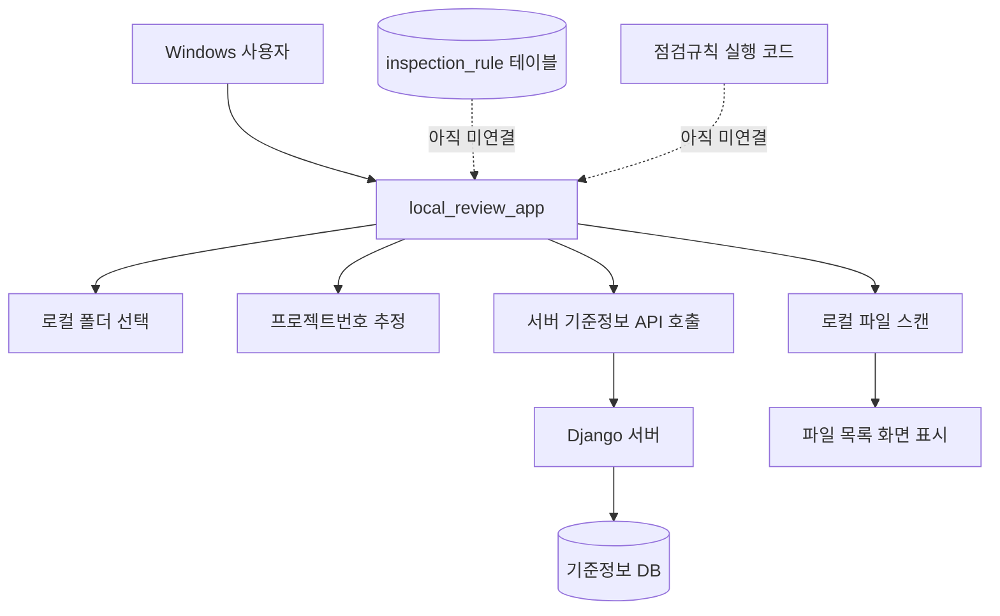
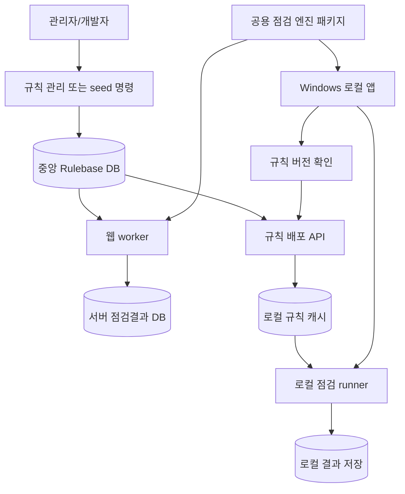
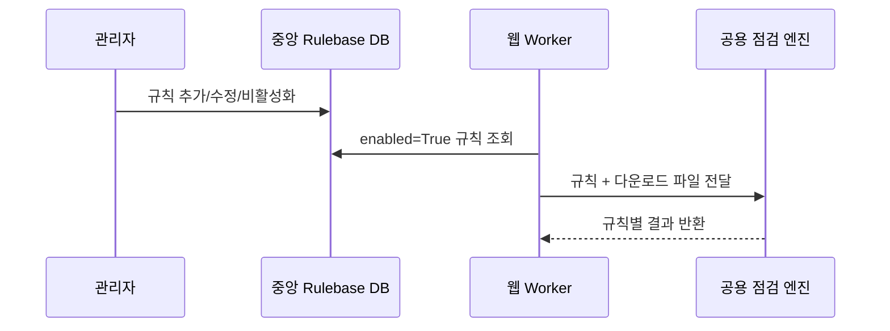
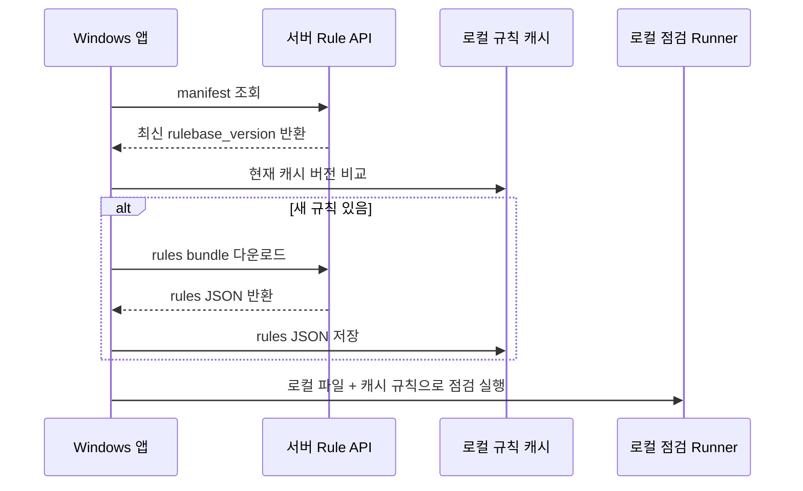
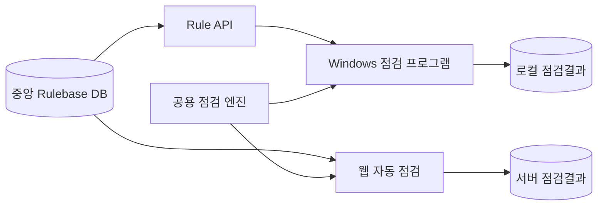

# 점검규칙 공유 아키텍처 구성도

## 목적

웹 자동 점검과 Windows 로컬 점검 프로그램이 같은 점검규칙을 사용하도록 구조를 정리한다.

핵심 목표는 다음과 같다.

- 규칙 정의는 한곳에서 관리한다.
- 웹은 서버의 최신 규칙을 자동으로 사용한다.
- Windows 프로그램은 서버에서 규칙 버전을 확인하고 업데이트해서 사용한다.
- 규칙 정의 변경과 규칙 실행 코드 변경을 구분한다.

## 현재 구조 요약

현재 점검규칙은 크게 두 부분으로 나뉜다.

| 구분 | 현재 위치 | 역할 |
| --- | --- | --- |
| 규칙 정의 | `DownloadReviewRule` 모델, DB 테이블 `inspection_rule` | 어떤 규칙을 어떤 설정으로 실행할지 저장 |
| 규칙 실행 코드 | `main/views/review/ecm_download_review_inspection.py` | `rule_type`별로 실제 파일/문서 검사를 수행 |
| 규칙 초기값/갱신 | `main/management/commands/seed_download_review_rules.py` | 코드에 정의된 기본 규칙을 DB에 seed |
| 규칙 결과 | `DownloadReviewRuleResult`, DB 테이블 `inspection_result` | 규칙별 통과/부적합/오류 결과 저장 |
| 웹 실행 흐름 | `ecm_download_review_worker.py` | 다운로드 후 `run_download_inspection()` 호출 |
| Windows 앱 | `local_review_app/` | 현재는 폴더 선택, 기준정보 조회, 파일 스캔까지만 구현 |

## 현재 웹 점검규칙 동작 구조

```mermaid
flowchart TD
    User[웹 사용자] --> WebUI[/download-review/ 화면]
    WebUI --> JobAPI[작업 생성 API]
    JobAPI --> JobDB[(workflow DB)]
    JobDB --> Worker[download-review worker]
    Worker --> ECM[ECM 다운로드 자동화]
    ECM --> DownloadFolder[다운로드 폴더]
    DownloadFolder --> Verify[download_verify.py 파일 확인]
    Verify --> Inspect[run_download_inspection]

    RuleDB[(inspection_rule 테이블)]
    RuleSeed[seed_download_review_rules.py]
    RuleCode[ecm_download_review_inspection.py rule_type 실행 코드]

    RuleSeed --> RuleDB
    RuleDB --> Inspect
    RuleCode --> Inspect

    Inspect --> ResultDB[(inspection_result 테이블)]
    Inspect --> ProjectStatus[프로젝트 점검결과 갱신]
    ResultDB --> ResultAPI[결과 조회 API]
    ResultAPI --> WebUI
```

현재 웹은 서버 안에서 모든 것을 처리한다. 따라서 서버 DB의 `inspection_rule`이 바뀌거나 서버 코드가 배포되면 웹 자동 점검은 곧바로 최신 상태를 사용한다.

## 현재 Windows 프로그램 동작 구조



현재 Windows 프로그램은 아직 실제 점검규칙 실행까지 연결되어 있지 않다. 즉, 지금은 서버 기준정보 조회와 파일 스캔까지만 가능하다.

## 현재 구조의 중요한 한계

현재 규칙은 완전히 “설정만으로 동작하는 규칙 엔진”은 아니다.

현재 구조는 다음과 같다.

```text
inspection_rule.config_json
  -> 규칙별 상세 조건

inspection_rule.rule_type
  -> 어떤 검사 함수를 쓸지 결정

ecm_download_review_inspection.py
  -> rule_type별 실제 검사 코드
```

따라서 변경 유형에 따라 배포 방식이 달라진다.

| 변경 유형 | 예시 | 웹 반영 | Windows 프로그램 반영 |
| --- | --- | --- | --- |
| 규칙 설정 변경 | 파일명 키워드, 확장자, 기대값, 메시지 변경 | 서버 DB 갱신 후 자동 적용 | 앱이 서버에서 최신 규칙을 다시 받으면 적용 가능 |
| 규칙 활성/비활성 변경 | 특정 규칙 `enabled` 변경 | 서버 DB 갱신 후 자동 적용 | 앱이 서버에서 최신 규칙을 다시 받으면 적용 가능 |
| 기존 `rule_type`으로 표현 가능한 규칙 추가 | `required_artifact_file` 규칙 추가 | 서버 DB 갱신 후 자동 적용 | 앱이 해당 `rule_type`을 지원하면 규칙 업데이트만으로 적용 가능 |
| 새 검사 로직 추가 | 새 `rule_type` 또는 새 문서 파서 추가 | 서버 코드 배포 필요 | 프로그램 업데이트 필요 |
| 파서/추출 로직 수정 | Word/PDF/Excel 추출 방식 변경 | 서버 코드 배포 필요 | 프로그램 업데이트 필요 |

즉, 규칙베이스를 한곳에 둔다고 해도 “규칙 정의”와 “규칙 실행 엔진”은 따로 관리해야 한다.

## 권장 목표 구조

권장 구조는 서버를 규칙베이스의 원본으로 두고, 웹과 Windows 프로그램이 같은 규칙 버전을 바라보게 하는 방식이다.



이 구조에서 서버는 다음을 담당한다.

- 규칙 정의 원본 저장
- 규칙 버전 관리
- Windows 앱에 규칙 manifest 제공
- 필요 시 규칙 bundle 제공
- 웹 worker에서 최신 규칙 직접 사용

Windows 앱은 다음을 담당한다.

- 시작 시 서버 규칙 버전 확인
- 최신 규칙 다운로드
- 로컬 캐시에 저장
- 로컬 파일 대상으로 공용 점검 엔진 실행
- 서버 연결 실패 시 마지막으로 받은 규칙 캐시 사용

## 중앙 규칙베이스 구성안

중앙 규칙베이스는 다음 정보를 제공해야 한다.

| 항목 | 설명 |
| --- | --- |
| `rulebase_version` | 규칙 묶음 버전 |
| `engine_min_version` | 이 규칙을 실행하기 위해 필요한 최소 엔진 버전 |
| `rules` | 활성 규칙 목록 |
| `rule_type` | 실행할 검사 유형 |
| `config_json` | 규칙별 상세 조건 |
| `updated_at` | 규칙 최종 갱신 시각 |
| `checksum` | 다운로드한 규칙 bundle 검증용 값 |

현재 `DownloadReviewRule` 모델은 이미 규칙 정의 저장소 역할을 하고 있으므로, 우선은 이 테이블을 중앙 rulebase로 사용하고 API만 추가하는 방식이 가장 현실적이다.

## 규칙 배포 API 초안

Windows 프로그램 업데이트를 위해 다음 API를 추가하는 것을 권장한다.

| 목적 | API | 설명 |
| --- | --- | --- |
| 규칙 버전 확인 | `GET /api/local-review/rules/manifest/` | 최신 규칙 버전, 필요한 엔진 버전, checksum 조회 |
| 규칙 bundle 다운로드 | `GET /api/local-review/rules/bundle/` | 활성 규칙 목록과 config JSON 다운로드 |
| 특정 버전 다운로드 | `GET /api/local-review/rules/bundle/?version=2026.06.19.1` | 지정 버전 규칙 다운로드 |

manifest 응답 예시는 다음과 같다.

```json
{
  "success": true,
  "rulebase_version": "2026.06.19.1",
  "engine_min_version": "0.2.0",
  "checksum": "sha256:...",
  "published_at": "2026-06-19T10:00:00+09:00"
}
```

bundle 응답 예시는 다음과 같다.

```json
{
  "success": true,
  "rulebase_version": "2026.06.19.1",
  "engine_min_version": "0.2.0",
  "rules": [
    {
      "code": "artifact_01",
      "name": "계약서",
      "rule_type": "required_artifact_file",
      "config_json": {},
      "severity": "error",
      "sort_order": 1,
      "enabled": true
    }
  ]
}
```

## 웹 적용 방식

웹은 서버 내부에서 실행되므로 규칙 적용 방식이 가장 단순하다.



웹에서는 중앙 DB가 최신이면 다음 실행부터 자동 적용된다. 단, 새 `rule_type`이 필요한 경우에는 서버 코드 배포가 필요하다.

## Windows 프로그램 적용 방식

Windows 프로그램은 사용자의 PC에 설치되어 있으므로 서버처럼 즉시 코드가 바뀌지 않는다. 따라서 업데이트 범위를 둘로 나눈다.

### 1. 규칙 정의 업데이트

기존 엔진이 이미 지원하는 `rule_type`의 설정만 바뀌면 프로그램 재설치 없이 적용할 수 있다.



### 2. 프로그램 업데이트

새 `rule_type`, 새 문서 파서, 새 추출 로직이 필요하면 규칙 JSON만으로는 부족하다. 이 경우 Windows 프로그램 자체 업데이트가 필요하다.

권장 방식은 다음과 같다.

| 업데이트 대상 | 적용 방식 |
| --- | --- |
| 규칙 조건/키워드/기대값 | 서버 rule bundle 다운로드 |
| 규칙 활성/비활성 | 서버 rule bundle 다운로드 |
| 새 규칙이지만 기존 `rule_type` 사용 | 서버 rule bundle 다운로드 |
| 새 `rule_type` 추가 | 프로그램 업데이트 |
| 문서 파서 수정 | 프로그램 업데이트 |
| UI 변경 | 프로그램 업데이트 |

## Windows 프로그램 업데이트 정책안

Windows 프로그램은 다음 정책을 권장한다.

1. 앱 시작 시 `rules/manifest/`를 호출한다.
2. 로컬 캐시의 `rulebase_version`과 서버 버전을 비교한다.
3. 서버 버전이 더 높으면 `rules/bundle/`을 다운로드한다.
4. `engine_min_version`이 현재 앱 엔진 버전보다 높으면 “프로그램 업데이트 필요” 메시지를 표시한다.
5. 서버 연결 실패 시 마지막으로 받은 로컬 규칙 캐시로 실행한다.
6. 로컬 캐시도 없으면 점검 실행을 막고 서버 연결을 안내한다.

이 방식이면 대부분의 규칙 수정은 서버에서 관리하고, 프로그램 업데이트는 실행 엔진 변경이 있을 때만 필요하다.

## 추천 구현 단계

### 1단계: 공용 규칙 모델 정리

- `DownloadReviewRule`을 서버 중앙 rulebase로 확정한다.
- 규칙 bundle에 포함할 필드를 확정한다.
- `rulebase_version` 산정 방식을 정한다.

### 2단계: 규칙 배포 API 추가

- `GET /api/local-review/rules/manifest/`
- `GET /api/local-review/rules/bundle/`
- 응답에 `engine_min_version`, `rulebase_version`, `checksum` 포함

### 3단계: 공용 점검 엔진 경계 분리

현재 `run_download_inspection()`은 Django ORM에 강하게 묶여 있다. Windows 앱에서도 쓰려면 다음 경계를 분리하는 것이 좋다.

```text
입력:
  - 프로젝트 기준정보
  - 로컬 파일 목록
  - 규칙 목록 JSON

출력:
  - 규칙별 결과 목록
  - 전체 통과/부적합 요약
```

이 공용 엔진은 DB에 직접 저장하지 않고 결과 객체만 반환해야 한다. 웹은 반환된 결과를 `DownloadReviewRuleResult`에 저장하고, Windows 앱은 로컬 SQLite 또는 파일로 저장한다.

### 4단계: 웹 runner 연결

- 웹 worker는 중앙 DB에서 규칙을 읽는다.
- 공용 엔진을 호출한다.
- 결과를 서버 DB에 저장한다.

### 5단계: Windows runner 연결

- 앱이 서버에서 규칙 bundle을 받는다.
- 로컬 캐시에 저장한다.
- 공용 엔진으로 로컬 폴더를 점검한다.
- 결과를 앱 화면에 표시한다.

## 최종 목표 구조



핵심은 다음이다.

- 규칙 정의는 중앙 DB 한곳에 둔다.
- 웹은 중앙 DB의 최신 규칙을 바로 사용한다.
- Windows 프로그램은 규칙 API로 최신 규칙을 내려받는다.
- 규칙 실행 엔진은 웹과 Windows가 공유한다.
- 새 실행 로직이 필요한 경우에만 프로그램 업데이트가 필요하다.
